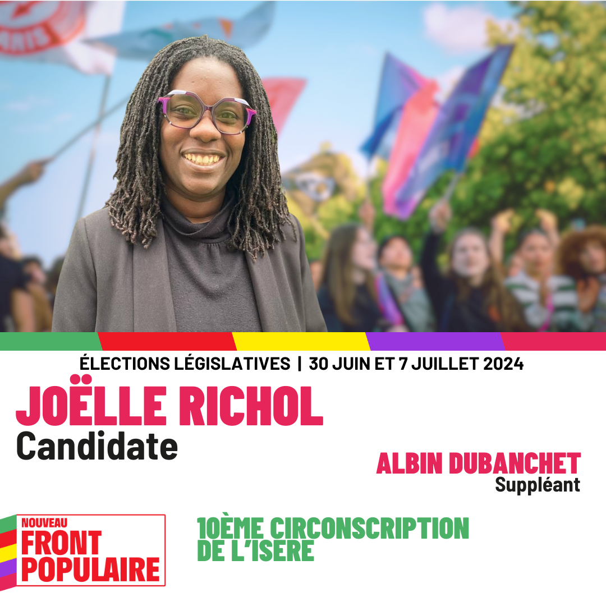

<head>
  <link href="assets/css/custom.css" rel="stylesheet" type="text/css" />
</head>
<section class="entete">
  <!-- Ci-dessous la photo de votre candidat·e -->
  

<h1>Le 30 juin, votez Joëlle RICHOL pour le Nouveau Front Populaire !</h1>

</section>

<section class="programme">

  <h2>Notre programme : 100 jours pour tout changer</h2>

<ul>
  <li>
    Pour notre pouvoir d’achat et les droits sociaux
  </li>
  <li>
    Pour la démocratie et l’égalité entre toutes et tous
  </li>
  <li>
    Pour notre santé et nos services publics
  </li>
  <li>
    Pour le vivant et le climat
  </li>
  <li>
    Pour la relocalisation des industries et des emplois
  </li>
  <li>
    Pour la paix partout, en Ukraine et à Gaza
  </li>
</ul>

  <a href="https://www.nouveaufrontpopulaire.fr/">Voir le programme en détail.</a>

</section>

<section class="contact">
  

Vous pouvez aussi soutenir Joëlle Richol et retrouver son actualité sur <a href="https://www.facebook.com/profile.php?id=61561310660096">sa page Facebook</a>.

</section>

<section class="procuration">

<h2>Votez par procuration</h2>

Vous ne pouvez pas vous déplacer le 30 juin ou le 7 juillet prochain ?

Prenez contact rapidement avec des personnes volontaires sur <a href="https://actionpopulaire.fr/procuration">Action Populaire</a>.

</section>

<section class="inscription">

<h2>Où voter ?</h2>

<ul>
<li>Vous ne savez pas quel est votre bureau de vote ?</li>
<li>Vous n'êtes pas sûr·es d'être inscrit·e ?</li>
</ul>

Retrouvez vos informations pour <strong>voter les 30 juin et 7 juillet</strong> sur <a href="https://www.service-public.fr/particuliers/vosdroits/R51788">Service-Public.fr</a>

</section>

<section class="villes">

<h2>Le 30 juin et le 7 juillet, votez et faites votez autour de vous !</h2>

Que vous soyez électeur ou électrice à Bourgoin Jallieu, La Verpillère, L'Isle-d'Abeau, La Tour-du-Pin, Pont-de-Beauvoisin… chaque vote compte pour empêcher l'extrême-droite d'arriver au pouvoir !

</section>

